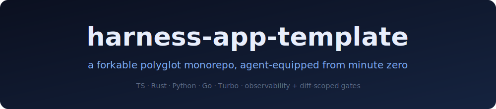

<p align="center">
  
</p>

<p align="center">
  <a href="LICENSE"></a>
  
  
  
</p>

# harness-app-template

> **A canonical, forkable agentic-engineering harness monorepo.** The repo IS the artifact. You start by clicking GitHub's **"Use this template"** button (or `git clone` + fork) and running a one-shot `just init <your-project-name>`.

<!-- TEMPLATE-DOC-START -->
This block is the template's "first read" introduction. **`scripts/init.ts` removes the entire `<!-- TEMPLATE-DOC-START/END -->` block on `just init`** so your fork's README opens directly at "What this is" below.
<!-- TEMPLATE-DOC-END -->

## What this is

A polyglot monorepo wired with an **eleven-slot agentic-engineering harness**: stack manager, inspector, hooks, telemetry SDK, observability stack, sensors, agent plugins, task runner, secret scanner, doc validator, versioning. Each slot has a research-backed plugin pick and a written rationale you can read at [`docs/decisions/`](./docs/decisions/).

The harness gives an AI coding agent (Claude / Codex / Gemini) the *environment* it needs to be effective: instrumented apps, queryable observability, evidence-capture skills, fast-fail gates on every commit. Your job is to build the application; the harness is what's already wrapped around it.

This template is **standalone**: extracted once from the upstream R&D repo ([`agentic-harness-lab`](https://github.com/NeuralEmpowerment/agentic-harness-lab)) and now evolves independently. The lab is research, not a live upstream — see [`docs/decisions/cha-sync-source-of-truth.md`](./docs/decisions/cha-sync-source-of-truth.md).

## Get started — fork-first

1. **Click "Use this template"** on the GitHub repo page (or fork directly). GitHub creates a new repo under your account.
2. **Clone your new repo** locally.
3. **Add the `upstream` remote** so future `just update` knows where to fetch from. GitHub "Use this template" doesn't set this for you — every consumer needs the one-time:

   ```sh
   git remote add upstream https://github.com/syntropic137/harness-app-template
   ```

4. **Run `just init <your-project-name>`** at the repo root. The script (`scripts/init.ts`, TypeScript via Bun, ≤150 lines) does a bounded set of renames — seed names `@example/typescript`, `@example/rust`, `@example/python`, `example-rust`, `example-python` → your project's equivalents; sets `pyproject.toml#project.name`; renames the compose project namespace at `harness/observability/compose.harness.yml`; writes `.harness-provenance.json` (git-native — `canonical_repo`, `canonical_commit`, `forked_at`); removes `TEMPLATE.md` and this `<!-- TEMPLATE-DOC-START/END -->` block. Fails fast if `bun`, `pnpm`, `cargo`, or `uv` aren't on `PATH`.
5. **Run `just bootstrap && just build && just test`** to confirm everything wired up. `just` is the canonical entrypoint — every recipe is one line away.
6. **Commit + push.** Your fork is now your project.

> A future `npx create-harness-app` scaffolder is planned to wrap this template (variable substitution + multi-template selection) for users who prefer a CLI to the fork-first flow. It will be a separate repo; this template repo remains the canonical artifact. Until then, fork or "Use this template" is the supported get-started path.

## Glossary

Seven terms a newcomer needs to read the rest of this README without confusion.

### 1. Tool

The concrete capability you invoke — the thing you actually run on the command line. For example: "I'm using the secret-scanner *tool* when I run `gitleaks`." Tools are interchangeable behind a slot's contract. **"Tool" and "slot" are not synonyms** — the slot is the labeled hole on the belt (a contract); the tool is what fits in the hole at runtime (the executable behavior).

### 2. Template

A specific assembly of plugin picks (one per slot) plus the workspace conventions and config files needed to make them coexist. **This repo IS a template** — the polyglot-monorepo template — published as a GitHub template repository. You start a new project by clicking "Use this template" or forking, not by running a CLI.

### 3. Slot

A named, labeled hole on the tool belt that defines a contract — what kind of plugin can fill it, what interface that plugin must expose. The eleven slots — `stack-manager`, `inspector`, `hooks`, `telemetry-sdk`, `observability-stack`, `sensors`, `agent-plugins`, `task-runner`, `secret-scanner`, `doc-validator`, `versioning` — are fixed shapes; plugins are swappable inside each shape. See [`docs/decisions/<slot>.md`](./docs/decisions/) for the rationale behind each pick.

### 4. Plugin

The specific implementation that fills a slot. Plugins are interchangeable as long as they honor the slot's contract. For example, the `task-runner` slot ships `just` as its reference plugin; swapping to Makefile would be a plugin replacement, not a slot redesign. Some slots ship multiple plugin implementations (`telemetry-sdk` has Node, Rust, and Python plugins — one slot, three implementations, all honoring the same contract). Where "tool" is the colloquial / runtime word, "plugin" is the formal word inside the harness Standard.

### 5. Workspace member

A self-contained sub-project living under `ws_apps/` or `ws_packages/` at the repo root. Each member declares its primary language via the manifest file it ships (`Cargo.toml` → Rust; `pyproject.toml` → Python; `package.json` → TypeScript/Node; `go.mod` → Go). Tests are co-located inside the member, per language convention. `ws_apps/` holds deployable units; `ws_packages/` holds shared libraries.

### 6. Language wrapper

A tiny `package.json` (typically 6 lines, no runtime dependencies) shipped inside a non-JS workspace member whose `scripts.build` / `scripts.test` / `scripts.lint` shell out to the language-native tool (`cargo build --release`, `uv run pytest`, `go build`, etc.). The wrapper is the bridge that lets Turborepo see a Rust / Python / Go member as a node in its task graph and cache its outputs. This is the pattern the Turborepo monorepo itself uses for its own Rust crates.

### 7. Virtual manifest

The root `Cargo.toml` of a Cargo workspace that contains a `[workspace]` table but no `[package]` table — declaring the workspace shape without itself being a crate. The pattern is "no primary package, several sibling crates." It's the standard Cargo convention for monorepos and what this repo's root `Cargo.toml` ships.

## What harness engineering is

A harness is *a named set of contracts + plugin picks + evidence + conventions.* Not a framework, not a library, not a product.

Each loop on the tool belt is a **slot** with a fixed shape. Each tool that fits the slot is a **plugin**. A **template** is a specific belt assembly — one plugin per slot, plus the workspace wiring that lets them coexist. **Slots are stable; plugins are swappable.** That's what lets opinionated picks evolve without breaking downstream forks.

The discipline was named by [Mitchell Hashimoto](https://mitchellh.com/writing/my-ai-adoption-journey) and developed in parallel by [OpenAI](https://openai.com/index/harness-engineering/) and [Martin Fowler](https://martinfowler.com/articles/harness-engineering.html). The CLI scaffolder (when it ships in a future arc) will be a thinner ergonomic wrapper around the same artifact — the harness itself is what you assemble, fork, and ship.

## The five principles

### 1. Measured, not assumed.

Every gate, every plugin, every threshold in the harness has a written rationale you can read at [`docs/decisions/`](./docs/decisions/). Change a gate in your fork → file your own hypothesis-first experiment using the bundled [`running-experiments`](./.claude/skills/running-experiments/SKILL.md) skill. The harness teaches the discipline; it does not just enforce it. Decision docs live in your fork's tree from day 1; use them as seeds for your own future ADRs alongside the inherited ones.

### 2. Token-aware by default.

The shipped LogsQL queries default to `| fields` projection (~12× smaller responses on the highest-volume call). Evidence bundles size per bug class (image-free for non-visual bugs). Skills load on demand and budget for context. Verbose output is opt-in, never default. See [`docs/decisions/observability-stack.md`](./docs/decisions/observability-stack.md) and [`.claude/skills/observability-queries/SKILL.md`](./.claude/skills/observability-queries/SKILL.md).

### 3. Polyglot-first.

Adopt TypeScript, Rust, Python, or Go inside `ws_apps/` — the gates, the telemetry pipeline, and the observability stack work the same way for each. Drop a language you don't use (delete its workspace manifest and the [language wrappers](#6-language-wrapper)); the harness shrinks rather than breaks.

### 4. Cross-platform and pragmatic.

`just` is the entrypoint — every recipe is one line away. macOS and Linux are first-class; Windows works for most recipes but is not the priority. The harness has plug points: remove a slot you don't need and nothing else breaks.

### 5. The harness ships its own gates.

The pre-commit hooks and test runners are wired to run on this repo's own code. The `sensors` and `doc-validator` slots ship visible stubs so the slot contracts are present without pretending the full plugins have landed. See [`security.md`](./security.md) for the full controls list.

## What ships in this repo

Eleven slots, eleven plugin picks. Standard pinned at **v0.2** (additive-only since v0.1; disclosed as draft in the lab's `docs/standard/v0.2.md`).

| Slot | Plugin | Decision doc |
|---|---|---|
| `stack-manager`       | Rust binary (bollard + portpicker)                                                  | [`docs/decisions/stack-manager.md`](./docs/decisions/stack-manager.md) |
| `inspector`           | Playwright + ffmpeg                                                                 | [`docs/decisions/inspector.md`](./docs/decisions/inspector.md) |
| `hooks`               | lefthook                                                                            | [`docs/decisions/hooks.md`](./docs/decisions/hooks.md) |
| `telemetry-sdk`       | `@opentelemetry/sdk-node` (TS) / `opentelemetry-otlp` (Rust) / `opentelemetry-sdk+distro` (Py) | [`docs/decisions/telemetry-sdk.md`](./docs/decisions/telemetry-sdk.md) |
| `observability-stack` | OTEL Collector → VictoriaLogs / VictoriaMetrics / VictoriaTraces                   | [`docs/decisions/observability-stack.md`](./docs/decisions/observability-stack.md) |
| `sensors` (opt-in)    | Stubbed `harness/sensors` slot; replace with Rust aggregator when needed             | [`docs/decisions/sensors.md`](./docs/decisions/sensors.md) |
| `agent-plugins`       | `.claude/` canonical + vendor symlinks                                              | [`docs/decisions/agent-plugins.md`](./docs/decisions/agent-plugins.md) |
| `task-runner`         | `just`                                                                              | [`docs/decisions/task-runner.md`](./docs/decisions/task-runner.md) |
| `secret-scanner`      | Gitleaks                                                                            | [`docs/decisions/secret-scanner.md`](./docs/decisions/secret-scanner.md) |
| `doc-validator`       | Stubbed `harness/doc-validator` slot; replace with Rust validator when needed        | [`docs/decisions/doc-validator.md`](./docs/decisions/doc-validator.md) |
| `versioning`          | cocogitto                                                                           | [`docs/decisions/versioning.md`](./docs/decisions/versioning.md) |

All workspace members under `ws_apps/` and `ws_packages/` participate in the same Turborepo task graph regardless of primary language, via the [language-wrapper](#6-language-wrapper) pattern.

This template pins Tool-Belt Harness Standard v0.2 (additive-only since v0.1).

### Shipped agent skills

Five on-demand skills under [`.claude/skills/`](./.claude/skills/) — the agent loads them when the task matches their description:

- [`running-experiments`](./.claude/skills/running-experiments/) — hypothesis-first experiments, FOCUS gate, verdict vocabulary, retrospective lifecycle.
- [`before-after-evidence`](./.claude/skills/before-after-evidence/) — reviewable evidence bundles (screenshot pair, ffmpeg keyframe grid, trace correlation).
- [`observability-queries`](./.claude/skills/observability-queries/) — canonical LogsQL / PromQL / TraceQL queries; severity-not-level, `| fields` projection, no `|~` regex pipe.
- [`playwright-debug`](./.claude/skills/playwright-debug/) — drive your app via Playwright (DOM, console errors, network failures, screenshots, trace correlation).
- [`chrome-devtools-deep`](./.claude/skills/chrome-devtools-deep/) — raw Chrome DevTools Protocol via `newCDPSession` for perf traces, source-mapped stacks, heap snapshots.

## Updating your fork

This template tracks an upstream canonical repo (`syntropic137/harness-app-template`). To pull harness improvements into your fork:

```sh
git fetch upstream             # the remote you set up in Get started step 3
just update                    # path-scoped — see docs/updating.md
```

The update is **path-scoped by construction**: only harness-owned surfaces (`harness/`, `.claude/`, `scripts/`, `docs/standard/`, root tooling configs, `security.md`, `harness.manifest.json`, etc.) get fast-forwarded. Your `ws_apps/`, `ws_packages/`, and `infra/` stay byte-for-byte untouched — `update.ts` does a `git checkout upstream/<ref> -- <harness-paths>`, never a whole-repo merge.

**The lab is NOT a live upstream.** The R&D lab ([`agentic-harness-lab`](https://github.com/NeuralEmpowerment/agentic-harness-lab)) is research; this template was extracted from it once and now evolves on its own. See [`docs/decisions/cha-sync-source-of-truth.md`](./docs/decisions/cha-sync-source-of-truth.md).

Deeper details — preview mode, the `just update --force` semantics for uncommitted-change handling, the harness-owned path list, the `.harness-provenance.json` schema — live at [`docs/updating.md`](./docs/updating.md).

## Security

This template ships a security standard at [`security.md`](./security.md): consumer-owned lockfile policy, dependency-audit expectations, SAST + secret scanning + UBS bug scanning wired through pre-commit / pre-push / `Claude PostToolUse` gates (per the `hooks` slot), and a Sigstore-based signing model for future binary releases. The threat model and a coordinated-disclosure reporting path are at the top of that file. If you fork, read `security.md` once and run `just doctor` to verify the required tools are present — silently-skipping gates are a worse posture than no gates.

## Inspiration & prior art

The harness-engineering discipline was named and developed by these field-defining writeups. Each citation has been WebSearch-verified.

- **Mitchell Hashimoto — "My AI Adoption Journey" § Step 5: Engineer the Harness** ([mitchellh.com](https://mitchellh.com/writing/my-ai-adoption-journey), Feb 2026). Hashimoto's framing — *"anytime you find an agent makes a mistake, take the time to engineer a solution such that the agent never makes that mistake again"* — is the seed of the discipline. The bundled `running-experiments` skill operationalizes Hashimoto's frame.
- **OpenAI — "Harness engineering: leveraging Codex in an agent-first world"** ([openai.com](https://openai.com/index/harness-engineering/), Feb 2026). Ryan Lopopolo's follow-up to Hashimoto: *"the environment was underspecified — agents lacked tools, abstractions, internal structure required to make progress."*
- **Martin Fowler — "Harness engineering for coding agent users"** ([martinfowler.com](https://martinfowler.com/articles/harness-engineering.html), Apr 2026). The three interlocking systems — context engineering, architectural constraints, entropy management. This template's `docs/decisions/` + `harness-doc-validator` + fitness sensors map onto Fowler's taxonomy.
- **Stripe — "Minions, Part 2 (Toolshed)"** ([stripe.dev](https://stripe.dev/blog/minions-stripes-one-shot-end-to-end-coding-agents-part-2)). The 400-tool MCP server pattern; industrial-scale evidence that the harness, not the model, is the hard part.
- **arXiv — "Agentic Harness Engineering: Observability-Driven Automatic Evolution of Coding-Agent Harnesses"** ([arxiv.org/abs/2604.25850](https://arxiv.org/abs/2604.25850), v1 Apr 2026, v4 May 2026). The observability-driven auto-evolution thread.

For the field landscape: [`ai-boost/awesome-harness-engineering`](https://github.com/ai-boost/awesome-harness-engineering), [`walkinglabs/awesome-harness-engineering`](https://github.com/walkinglabs/awesome-harness-engineering), [`Picrew/awesome-agent-harness`](https://github.com/Picrew/awesome-agent-harness).

### Where this template differs

- **Not a multi-agent framework.** No Planner / Generator / Evaluator split; a single agent operates against the environment.
- **Not an MCP server marketplace.** Skills, not MCP, are the primary plugin shape — context cost dominates.
- **Not opinionated about which agent model you run.** `.claude/` is canonical; `AGENTS.md`, `GEMINI.md`, `.codex/`, `.gemini/` are symlinks pointing at it.
- **Not a CLI scaffolder.** The repo IS the artifact; you fork or click "Use this template." A wrapping CLI is planned as a separate future repo.

## Things this is NOT trying to be

**Nature** (what this fundamentally is and is not):

- Not a SaaS — every artifact ships in your repo.
- Not a framework — the harness wraps *around* your application code; it doesn't prescribe how to write it.
- Not an LLM agent — the harness is the *environment* an agent operates in. Bring your own model.
- Not a CLI scaffolder. The repo is what you fork.

**Scope** (what's in v0.4.0):

- Not a multi-agent orchestrator (see "Where this template differs").
- Not a monolith — slots can be removed, plugins can be swapped.

Tactical agent guidance (`No Chrome container`, no `|~` regex pipe in LogsQL, etc.) lives in [`CLAUDE.md`](./CLAUDE.md), not here.

## Status, versioning, license

- **Version:** v0.4.0 — first standalone release. Versioned via cocogitto per [`docs/decisions/versioning.md`](./docs/decisions/versioning.md).
- **Standard:** pins Tool-Belt Harness Standard v0.2 (additive-only since v0.1; the lab marks it `Status: draft`).
- **License:** MIT — see [`LICENSE`](./LICENSE).
- **Future scaffolder:** a CLI wrapper (`npx create-harness-app`) is planned in a separate future repo. This template repo remains the canonical artifact; the CLI will be additive, not a replacement.

## Contributing

See [`CONTRIBUTING.md`](./CONTRIBUTING.md) for development workflow, branch policy, and how to push improvements upstream. Push a learning back via a commit subject `harness-engineering: from <your-repo>@<sha>`; the maintainer triages from there.

## Code of Conduct

See [`CODE_OF_CONDUCT.md`](./CODE_OF_CONDUCT.md).

## Support

- **Security:** see [`security.md`](./security.md) "Reporting" section — GitHub Security Advisory preferred.
- **Bugs / features:** GitHub Issues on this repo.
- **Discussion:** GitHub Discussions on this repo.
